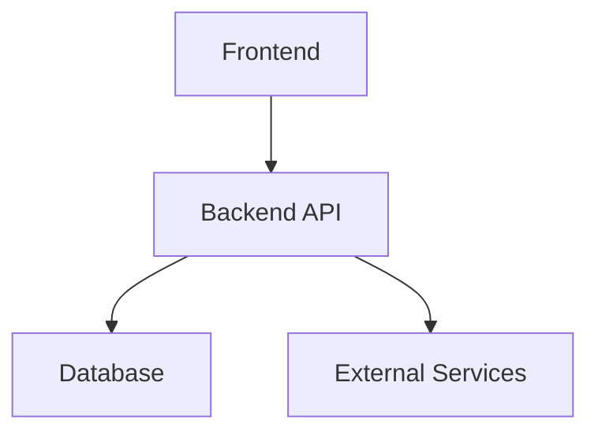

# Automated Multi-Agent Planning System Design

**Purpose**: Replace spec kit's sequential workflow with parallel multi-agent spec generation
**Location**: `dev-lifecycle-marketplace/plugins/planning/`
**Target**: Create ALL project specs in one shot from massive project description

---

## Problem Statement

### Current Issues:
1. **Spec kit**: Sequential (1, 2, 3, 4...), manual, slow, too much output
2. **Existing `/planning:spec`**: Natural language invocation (stalled), one at a time
3. **ai-tech-stack-1**: Plugins don't read specs (generate generic templates)

### What We Need:
1. **Massive prompt input** → Automatic feature breakdown → Parallel spec creation
2. **Minimal output per spec**: `spec.md`, `plan.md`, `tasks.md` only
3. **Structured JSON output** for agent chaining
4. **Works for NEW and EXISTING projects**

---

## Architecture Overview

```
User → /planning:init-project "massive description..."
  ↓
┌─────────────────────────────────────────────────┐
│ Orchestrator Command (init-project.md)         │
│ - Parse massive prompt                          │
│ - Identify N features                           │
│ - Extract shared context (stack, users, data)  │
└─────────────────────────────────────────────────┘
  ↓
┌─────────────────────────────────────────────────┐
│ Spawn N Parallel Agents                         │
│ Task(spec-writer-1) → specs/001-feature-a/      │
│ Task(spec-writer-2) → specs/002-feature-b/      │
│ Task(spec-writer-3) → specs/003-feature-c/      │
│ ... (all run simultaneously)                    │
└─────────────────────────────────────────────────┘
  ↓
Each agent creates:
  - spec.md (WHAT - user requirements)
  - plan.md (HOW - architecture, DB schema, APIs)
  - tasks.md (TASKS - numbered implementation steps)
  ↓
┌─────────────────────────────────────────────────┐
│ Return JSON Output                              │
│ {                                               │
│   "specs": [                                    │
│     {"number": "001", "name": "...", "path":""} │
│   ],                                            │
│   "sharedContext": {...},                       │
│   "readyForPhase0": true                        │
│ }                                               │
└─────────────────────────────────────────────────┘
  ↓
/ai-tech-stack-1:build-full-stack-phase-0
  - Reads ALL specs from JSON
  - Builds complete system
```

---

## File Structure

### Location: `dev-lifecycle-marketplace/plugins/planning/`

```
planning/
├── commands/
│   ├── init-project.md          ← NEW: Main orchestrator
│   ├── analyze-project.md       ← NEW: For existing projects
│   ├── add-spec.md              ← NEW: Add single spec
│   ├── spec.md                  ← UPDATE: Use Task() syntax
│   ├── architecture.md          ← KEEP (already fixed)
│   ├── decide.md                ← KEEP (already fixed)
│   └── roadmap.md               ← KEEP (already fixed)
├── agents/
│   ├── feature-analyzer.md      ← NEW: Break massive prompt into features
│   ├── spec-writer.md           ← UPDATE: Parallel spec creation
│   ├── spec-analyzer.md         ← NEW: Analyze existing specs
│   ├── architecture-designer.md ← KEEP (existing)
│   ├── decision-documenter.md   ← KEEP (existing)
│   └── roadmap-planner.md       ← KEEP (existing)
├── skills/
│   └── spec-management/
│       ├── templates/
│       │   ├── spec-template.md     ← From spec kit (WHAT only)
│       │   ├── plan-template.md     ← From spec kit (HOW only)
│       │   └── tasks-template.md    ← From spec kit (TASKS only)
│       └── scripts/
│           └── generate-json-output.sh  ← NEW: JSON formatting
└── docs/
    └── automated-planning-workflow.md  ← NEW: Usage guide
```

---

## New Commands

### 1. `/planning:init-project <description>`

**Purpose**: Create ALL specs in one shot from massive project description

**Workflow**:
```markdown
Phase 1: Analysis
- Parse $ARGUMENTS (massive project description)
- Load feature-analyzer agent
- Task(feature-analyzer, prompt="Analyze this project and identify all features...")
- Agent returns JSON: {"features": ["exam-system", "voice-companion", ...]}

Phase 2: Shared Context Extraction
- Extract tech stack (Next.js, FastAPI, Supabase, etc.)
- Extract user types (Apprentice, Mentor, Employer, Admin)
- Extract shared data (trades, questions, etc.)
- Build context object for all agents

Phase 3: Parallel Spec Creation
- For each feature in JSON:
  - Task(spec-writer, prompt="Create spec/plan/tasks for {feature}

    FULL PROJECT CONTEXT:
    {massive project description}

    YOUR FEATURE FOCUS:
    {feature name and focus area}

    INTEGRATION POINTS:
    {references to other features}

    OUTPUT:
    - specs/{number}-{name}/spec.md
    - specs/{number}-{name}/plan.md
    - specs/{number}-{name}/tasks.md
    ")
- ALL agents run in parallel (single message with multiple Task calls)

Phase 4: JSON Output
- Collect all spec paths
- Generate JSON output:
  {
    "projectName": "extracted from description",
    "specs": [
      {"number": "001", "name": "exam-system", "path": "specs/001-exam-system"},
      ...
    ],
    "sharedContext": {
      "techStack": [...],
      "users": [...],
      "dataEntities": [...]
    },
    "readyForPhase0": true
  }
- Write to .planning/project-specs.json
- Display summary table
```

**Arguments**:
- `<description>` - Massive project description (can be multi-paragraph)

**Output**:
- Creates `specs/001-N/` directories
- Each with `spec.md`, `plan.md`, `tasks.md`
- Generates `.planning/project-specs.json`
- Returns JSON for next command

---

### 2. `/planning:analyze-project`

**Purpose**: Analyze EXISTING project with specs (like Red AI)

**Workflow**:
```markdown
Phase 1: Discovery
- Check for existing specs/ directory
- Count existing specs: 001, 002, 003, 004
- Read .planning/project-specs.json if exists

Phase 2: Parallel Analysis (one agent per spec)
- Task(spec-analyzer-1) → Analyze specs/001-red-seal-ai
- Task(spec-analyzer-2) → Analyze specs/002-mentorship-marketplace
- Task(spec-analyzer-3) → Analyze specs/003-create-an-employer
- Task(spec-analyzer-4) → Analyze specs/004-the-skilled-trades
- All run in parallel

Phase 3: Gap Analysis
- Consolidate findings from all analyzers
- Identify missing features (voice integration? payments?)
- Identify incomplete specs (missing plan.md or tasks.md?)
- Check code vs specs alignment

Phase 4: JSON Output
{
  "existingSpecs": [
    {"number": "001", "name": "red-seal-ai", "completeness": "80%"},
    ...
  ],
  "missingFeatures": ["voice-integration", "payment-system"],
  "incompleteSpecs": ["002-mentorship-marketplace"],
  "nextSteps": [
    "/planning:add-spec 'voice integration with Eleven Labs'",
    "/planning:spec fill 002-mentorship-marketplace"
  ]
}
```

**Arguments**: None (auto-detects current project)

**Output**:
- Gap analysis JSON
- Recommendations for next steps

---

### 3. `/planning:add-spec <feature-description>`

**Purpose**: Add ONE additional spec to existing project

**Workflow**:
```markdown
Phase 1: Numbering
- Find highest existing spec number
- Auto-increment (004 → 005)

Phase 2: Single Spec Creation
- Task(spec-writer, prompt="Create spec/plan/tasks for {feature}

  EXISTING PROJECT CONTEXT:
  {read from .planning/project-specs.json}

  NEW FEATURE:
  {feature description from $ARGUMENTS}

  INTEGRATION WITH:
  {list existing specs for reference}
  ")

Phase 3: Update JSON
- Append new spec to .planning/project-specs.json
- Return updated JSON

Phase 4: Summary
- Display new spec location
- Suggest next steps
```

**Arguments**:
- `<feature-description>` - Single feature to add

**Output**:
- Creates `specs/00N-feature/` with spec.md, plan.md, tasks.md
- Updates `.planning/project-specs.json`

---

## New Agents

### 1. `feature-analyzer.md`

**Purpose**: Break massive project description into discrete features

**Input**:
- Massive project description

**Process**:
1. Identify all user-facing features
2. Identify all backend/admin features
3. Identify all integration features
4. Group related functionality
5. Suggest numbering and naming

**Output** (JSON):
```json
{
  "features": [
    {
      "number": "001",
      "name": "exam-system",
      "shortName": "exam-system",
      "focus": "4-hour timed exams, 120 questions, scoring, results",
      "dependencies": [],
      "integrations": ["trade-library", "voice-companion"]
    },
    {
      "number": "002",
      "name": "voice-companion",
      "shortName": "voice-companion",
      "focus": "Eleven Labs STT/TTS, AI study mode, voice interactions",
      "dependencies": ["exam-system"],
      "integrations": []
    },
    ...
  ],
  "sharedContext": {
    "techStack": ["Next.js 15", "FastAPI", "Supabase", "Eleven Labs", "Stripe"],
    "userTypes": ["Apprentice", "Mentor", "Employer", "Admin"],
    "dataEntities": ["Trade", "Question", "Exam", "User", "Subscription"]
  }
}
```

**Key Rules**:
- Each feature should be independently testable
- Identify integration points (don't duplicate functionality)
- Use kebab-case for names
- Max 10 features (force grouping if more)

---

### 2. `spec-writer.md` (Updated)

**Purpose**: Create spec.md, plan.md, tasks.md for ONE feature (runs in parallel)

**Input**:
- Full project context (massive prompt)
- Feature focus (specific feature to spec)
- Integration points (references to other specs)
- Spec number and name

**Process**:
1. **Create spec.md** (WHAT - user requirements only):
   - Use spec-template.md structure
   - Focus on user value, business needs
   - NO implementation details
   - Success criteria (measurable, tech-agnostic)
   - User scenarios and acceptance criteria

2. **Create plan.md** (HOW - technical design):
   - Architecture for THIS feature
   - Database schema (tables, fields, relationships)
   - API endpoints (REST/GraphQL contracts)
   - Integration points with other features
   - Technology choices and rationale

3. **Create tasks.md** (TASKS - implementation steps):
   - Numbered task list
   - Grouped by phase (DB, Backend, Frontend, Integration)
   - Marked for parallelization where possible [P]
   - Dependencies noted

**Output**:
- `specs/{number}-{name}/spec.md`
- `specs/{number}-{name}/plan.md`
- `specs/{number}-{name}/tasks.md`

**Key Rules**:
- Keep spec.md tech-agnostic (no Next.js, FastAPI mentions)
- Put ALL tech in plan.md
- Make tasks.md actionable and testable
- Reference other specs by number (e.g., "Integrates with 001-exam-system")

---

### 3. `spec-analyzer.md` (New)

**Purpose**: Analyze ONE existing spec for completeness and quality

**Input**:
- Spec directory path (e.g., specs/001-exam-system/)

**Process**:
1. Check file existence (spec.md, plan.md, tasks.md)
2. Validate spec.md quality:
   - Has user scenarios?
   - Has success criteria?
   - Avoids implementation details?
3. Validate plan.md completeness:
   - Has database schema?
   - Has API contracts?
   - Has architecture diagram?
4. Validate tasks.md:
   - Are tasks numbered?
   - Are dependencies clear?
   - Are tasks testable?
5. Check spec vs code alignment:
   - Does code exist for this spec?
   - Are planned features implemented?
   - Are there unimplemented tasks?

**Output** (JSON):
```json
{
  "specNumber": "001",
  "specName": "exam-system",
  "completeness": {
    "spec": "100%",
    "plan": "80%",
    "tasks": "60%"
  },
  "missingFiles": [],
  "qualityIssues": [
    "plan.md missing API contracts section",
    "tasks.md has 12 tasks without dependencies marked"
  ],
  "implementationGaps": [
    "Task 3-7 not yet implemented in code",
    "Database schema exists but missing 'exam_sessions' table"
  ],
  "recommendations": [
    "Add API contracts to plan.md",
    "Mark task dependencies in tasks.md",
    "Implement remaining 5 tasks"
  ]
}
```

---

## Templates (From Spec Kit)

### spec-template.md
```markdown
# [Feature Name]

## Overview
[What this feature does for users]

## User Value
[Why users need this feature]

## User Scenarios
### Primary Scenario
[Main user flow]

### Edge Cases
[Unusual scenarios to handle]

## Functional Requirements
1. [Requirement 1 - testable]
2. [Requirement 2 - testable]

## Non-Functional Requirements
- Performance: [measurable criteria]
- Security: [compliance requirements]
- Usability: [UX standards]

## Success Criteria
- [Measurable outcome 1]
- [Measurable outcome 2]
- [Measurable outcome 3]

## Assumptions
- [What we're assuming about users/environment]

## Dependencies
- [References to other specs: 001-exam-system]

## Out of Scope
- [What this feature explicitly does NOT do]
```

### plan-template.md
```markdown
# [Feature Name] - Implementation Plan

## Technical Context
- **Stack**: [Next.js, FastAPI, Supabase, etc.]
- **Integrations**: [Eleven Labs, Stripe, etc.]
- **Dependencies**: [References to other features]

## Architecture

### Component Diagram


### Database Schema

#### Tables
**table_name**
- id (uuid, PK)
- field1 (type)
- field2 (type)
- created_at (timestamp)

**Relationships**:
- table_name.field → other_table.id (FK)

### API Contracts

#### Endpoints
**POST /api/feature/action**
```json
Request:
{
  "param1": "value"
}

Response:
{
  "result": "success"
}
```

## Integration Points
- **001-exam-system**: Uses exam data for analysis
- **005-trade-library**: References trade information

## Technology Choices

### Choice 1: [Technology]
**Rationale**: [Why chosen]
**Alternatives**: [What else considered]

## Security Considerations
- [RLS policies]
- [Auth requirements]
- [Data privacy]

## Performance Targets
- [Response times]
- [Concurrent users]
- [Data volumes]
```

### tasks-template.md
```markdown
# [Feature Name] - Implementation Tasks

## Phase 1: Database Setup
- [ ] 1.1 Create database tables [P]
- [ ] 1.2 Add RLS policies [P]
- [ ] 1.3 Create seed data
- [ ] 1.4 Test migrations

## Phase 2: Backend API
- [ ] 2.1 Create FastAPI endpoints [depends: 1.3]
- [ ] 2.2 Add Pydantic models [P]
- [ ] 2.3 Implement business logic [depends: 2.1]
- [ ] 2.4 Add error handling [P]
- [ ] 2.5 Write API tests [depends: 2.3]

## Phase 3: Frontend UI
- [ ] 3.1 Create Next.js pages [P]
- [ ] 3.2 Build UI components [P]
- [ ] 3.3 Connect to API [depends: 2.1]
- [ ] 3.4 Add form validation [depends: 3.3]
- [ ] 3.5 Add loading states [P]

## Phase 4: Integration
- [ ] 4.1 Integrate with 001-exam-system [depends: 3.3]
- [ ] 4.2 Test end-to-end flow [depends: 4.1]
- [ ] 4.3 Add monitoring [P]

## Phase 5: Polish
- [ ] 5.1 Accessibility audit [depends: 4.2]
- [ ] 5.2 Performance optimization [depends: 4.2]
- [ ] 5.3 Error messaging [depends: 4.2]
- [ ] 5.4 Documentation [P]

**Legend**:
- [P] = Can be done in parallel
- [depends: X] = Requires task X to be completed first
```

---

## JSON Output Format

### .planning/project-specs.json
```json
{
  "projectName": "Red Seal AI",
  "description": "Exam preparation platform for skilled trades workers in Canada",
  "createdAt": "2025-11-02T19:00:00Z",
  "specs": [
    {
      "number": "001",
      "name": "exam-system",
      "path": "specs/001-exam-system",
      "files": {
        "spec": "specs/001-exam-system/spec.md",
        "plan": "specs/001-exam-system/plan.md",
        "tasks": "specs/001-exam-system/tasks.md"
      },
      "status": "complete",
      "integrations": ["002-voice-companion", "005-trade-library"]
    },
    {
      "number": "002",
      "name": "voice-companion",
      "path": "specs/002-voice-companion",
      "files": {
        "spec": "specs/002-voice-companion/spec.md",
        "plan": "specs/002-voice-companion/plan.md",
        "tasks": "specs/002-voice-companion/tasks.md"
      },
      "status": "complete",
      "integrations": ["001-exam-system"]
    }
  ],
  "sharedContext": {
    "techStack": [
      "Next.js 15",
      "FastAPI",
      "Supabase",
      "Eleven Labs",
      "Stripe",
      "Vercel AI SDK",
      "Mem0"
    ],
    "userTypes": [
      "Apprentice",
      "Mentor",
      "Employer",
      "Admin"
    ],
    "dataEntities": [
      "Trade",
      "Question",
      "Exam",
      "User",
      "Subscription",
      "Mentor",
      "Session"
    ],
    "integrations": [
      "Eleven Labs (voice)",
      "Stripe (payments)",
      "Supabase (database/auth)"
    ]
  },
  "readyForPhase0": true
}
```

---

## Integration with ai-tech-stack-1

### Updated Phase 0

**Current** (ai-dev-marketplace/plugins/ai-tech-stack-1/commands/build-full-stack-phase-0.md):
```markdown
Phase 2: Spec Selection (if exists)
- Check for specs/ directory
- If exists: Load specs and enter spec-driven mode
- If missing: Use interactive mode (AskUserQuestion)
```

**New** (reads JSON instead):
```markdown
Phase 2: Spec Loading
- Check for .planning/project-specs.json
- If exists:
  - Load JSON
  - Parse all spec paths
  - Extract shared context (tech stack, users, data)
  - Enter spec-driven mode
  - Spawn parallel analyzers (one per spec)
- If missing:
  - Recommend: /planning:init-project first
  - OR use interactive mode (AskUserQuestion)

Phase 2A: Parallel Spec Analysis (if JSON exists)
- For each spec in JSON:
  - Task(spec-analyzer) → Analyze completeness
- Consolidate findings
- Determine what needs to be built
```

This way Phase 0 can:
1. Read ALL specs via JSON
2. Understand shared context
3. Build everything in one orchestrated flow

---

## Example Usage

### NEW Project from Scratch
```bash
# Step 1: Create all specs in one shot
/planning:init-project "Red Seal AI is an exam preparation platform for
skilled trades workers in Canada. It includes 4-hour timed practice exams
with 120 questions per trade, AI-powered voice study companion using Eleven
Labs, mentorship marketplace connecting apprentices with certified mentors,
employer portal for hiring, trade library with 57 Red Seal trades and AR
equipment scanning, payment system with Stripe (3 tiers), bilingual support
(English/French), and admin dashboard for managing questions/users/analytics."

→ Creates:
  specs/001-exam-system/
  specs/002-voice-companion/
  specs/003-mentorship-marketplace/
  specs/004-employer-portal/
  specs/005-trade-library/
  specs/006-payment-system/
  specs/007-admin-dashboard/
  .planning/project-specs.json

# Step 2: Build the application
/ai-tech-stack-1:build-full-stack-phase-0 red-seal-ai
→ Reads .planning/project-specs.json
→ Analyzes all 7 specs in parallel
→ Sets up foundation

/ai-tech-stack-1:build-full-stack-phase-1 red-seal-ai
→ Builds Next.js, FastAPI, Supabase based on ALL specs
→ Creates database schema from all plan.md files
→ Creates API endpoints from all plan.md files

/ai-tech-stack-1:build-full-stack-phase-2
→ Adds AI features (Vercel AI SDK, Mem0, Eleven Labs)

... continues through Phase 5
```

### EXISTING Project (Red AI)
```bash
# Step 1: Analyze what exists
/planning:analyze-project

→ Output:
{
  "existingSpecs": [
    {"number": "001", "name": "red-seal-ai", "completeness": "60%"},
    {"number": "002", "name": "mentorship-marketplace", "completeness": "40%"},
    {"number": "003", "name": "create-an-employer", "completeness": "70%"},
    {"number": "004", "name": "the-skilled-trades", "completeness": "80%"}
  ],
  "missingFeatures": [
    "voice-integration",
    "payment-system",
    "admin-dashboard"
  ],
  "recommendations": [
    "/planning:add-spec 'voice integration with Eleven Labs'",
    "/planning:add-spec 'payment system with Stripe'",
    "/planning:add-spec 'admin dashboard'",
    "/planning:spec fill 002-mentorship-marketplace"
  ]
}

# Step 2: Add missing specs
/planning:add-spec "voice integration with Eleven Labs for AI study companion"
→ Creates specs/005-voice-integration/

/planning:add-spec "payment system with Stripe for 3 subscription tiers"
→ Creates specs/006-payment-system/

/planning:add-spec "admin dashboard for managing questions, users, and analytics"
→ Creates specs/007-admin-dashboard/

# Step 3: Build missing pieces
/ai-tech-stack-1:build-full-stack-phase-0 redai
→ Reads ALL 7 specs
→ Identifies what's already built (001-004)
→ Plans to build missing pieces (005-007)

... continues building
```

---

## Implementation Plan

### Phase 1: Core Structure
1. Create templates in `skills/spec-management/templates/`
2. Create JSON output script in `skills/spec-management/scripts/`
3. Update existing agents to use Task() syntax (already done)

### Phase 2: New Agents
1. Create `agents/feature-analyzer.md`
2. Update `agents/spec-writer.md` for parallel execution
3. Create `agents/spec-analyzer.md`

### Phase 3: New Commands
1. Create `commands/init-project.md`
2. Create `commands/analyze-project.md`
3. Create `commands/add-spec.md`

### Phase 4: Integration
1. Update `ai-tech-stack-1/commands/build-full-stack-phase-0.md`
2. Test end-to-end workflow
3. Validate JSON output format

### Phase 5: Documentation
1. Create usage guide in `docs/automated-planning-workflow.md`
2. Add examples for NEW and EXISTING projects
3. Document JSON schema

---

## Next Steps

**Decision Point**: Who builds this?

**Option A**: I build it in `dev-lifecycle-marketplace` right now
- Fastest path to working system
- I'll commit and push as I go
- You can test immediately

**Option B**: You build it following this design doc
- You have full control
- I provide guidance as needed
- You learn the plugin structure

**Option C**: Hybrid approach
- I build Phase 1-2 (templates, agents)
- You build Phase 3-4 (commands, integration)
- Collaborate on Phase 5 (docs)

Which option do you prefer?
