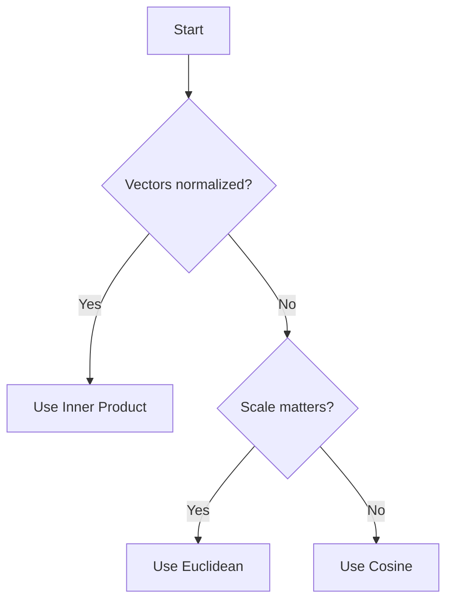

# Embedding Strategies Guide

## Index Selection: HNSW vs IVFFlat

### Decision Matrix

| Factor | HNSW | IVFFlat | Recommendation |
|--------|------|---------|----------------|
| **Dataset Size** | < 1M vectors | > 1M vectors | Use HNSW for most applications |
| **Query Speed** | Very fast (1-10ms) | Fast (10-50ms) | HNSW wins for read-heavy |
| **Insert Speed** | Slow (10-100ms) | Fast (1-10ms) | IVFFlat wins for write-heavy |
| **Recall** | 95-99% | 90-95% | HNSW for high precision |
| **Memory** | ~10KB/vector | ~1-2KB/vector | IVFFlat for large scale |
| **Setup** | No training | Requires training | HNSW easier to set up |

### Use HNSW When:
- ✓ Dataset under 1 million vectors
- ✓ Read-heavy workload (90%+ queries vs inserts)
- ✓ Need high recall (> 95%)
- ✓ Memory is available (16GB+ for 100K vectors)
- ✓ Can tolerate slower inserts
- ✓ Starting a new project (easier setup)

### Use IVFFlat When:
- ✓ Dataset over 1 million vectors
- ✓ Write-heavy workload (frequent inserts)
- ✓ Memory constrained
- ✓ Can tolerate 90-95% recall
- ✓ Have sufficient training data (> 1000 rows)
- ✓ Need faster bulk loading

### Migration Path

**Small to Large Dataset:**
```sql
-- Start with HNSW (< 1M vectors)
CREATE INDEX docs_embedding_idx ON documents
USING hnsw (embedding vector_cosine_ops)
WITH (m = 16, ef_construction = 64);

-- Migrate to IVFFlat when crossing 1M vectors
DROP INDEX docs_embedding_idx;
CREATE INDEX docs_embedding_idx ON documents
USING ivfflat (embedding vector_cosine_ops)
WITH (lists = 1000);
```

## Embedding Model Selection

### Common Embedding Models

| Model | Dimension | Use Case | Cost | Performance |
|-------|-----------|----------|------|-------------|
| **OpenAI text-embedding-3-small** | 1536 | General purpose | $0.02/1M tokens | Fast, balanced |
| **OpenAI text-embedding-3-large** | 3072 | High accuracy | $0.13/1M tokens | Best quality |
| **OpenAI ada-002** | 1536 | Legacy | $0.10/1M tokens | Good baseline |
| **Cohere embed-english-v3.0** | 1024 | English content | $0.10/1M tokens | Fast, efficient |
| **Cohere embed-multilingual-v3.0** | 1024 | Multi-language | $0.10/1M tokens | Global apps |
| **Sentence Transformers** | 384-768 | Self-hosted | Free | Local, privacy |

### Dimension Size Considerations

**Higher Dimensions (3072):**
- ✓ Better semantic understanding
- ✓ More nuanced similarity
- ✗ 2x storage cost
- ✗ Slower queries
- ✗ Higher memory usage

**Lower Dimensions (384-1024):**
- ✓ Faster queries
- ✓ Less storage
- ✓ Lower memory
- ✗ Less semantic detail
- ✗ May miss subtle relationships

**Recommendation:**
- Start with 1536 (OpenAI text-embedding-3-small)
- Upgrade to 3072 if quality issues
- Drop to 1024 for large-scale or budget constraints

### Model Selection by Use Case

**Document Search / RAG:**
- OpenAI text-embedding-3-small (1536)
- Best balance of cost and quality

**High-Precision Semantic Search:**
- OpenAI text-embedding-3-large (3072)
- Maximum semantic understanding

**Multi-Language Support:**
- Cohere embed-multilingual-v3.0 (1024)
- Handles 100+ languages

**Privacy / Self-Hosted:**
- Sentence Transformers all-MiniLM-L6-v2 (384)
- No external API calls

**Large Scale / Cost Sensitive:**
- Cohere embed-english-v3.0 (1024)
- Lower dimensions = lower costs

## Distance Metric Selection

### Cosine Distance (`<=>`)

**Formula:** `1 - (A · B) / (||A|| × ||B||)`

**Use When:**
- ✓ Vectors may have different magnitudes
- ✓ OpenAI or Cohere embeddings
- ✓ General purpose (safest default)

```sql
SELECT * FROM documents
ORDER BY embedding <=> query_embedding
LIMIT 10;
```

**Properties:**
- Range: 0 to 2 (1 = orthogonal)
- Similarity: 1 - distance
- Normalized: Direction matters, magnitude ignored

### Inner Product (`<#>`)

**Formula:** `-(A · B)`

**Use When:**
- ✓ Vectors are normalized (unit length)
- ✓ OpenAI embeddings (pre-normalized)
- ✓ Need faster queries

```sql
SELECT * FROM documents
ORDER BY embedding <#> query_embedding
LIMIT 10;
```

**Properties:**
- Range: -∞ to ∞
- Faster than cosine for normalized vectors
- Returns negative values (negate for similarity)

### Euclidean Distance (`<->`)

**Formula:** `||A - B||` (L2 distance)

**Use When:**
- ✓ Absolute distances matter
- ✓ Clustering applications
- ✓ Not using cosine-optimized embeddings

```sql
SELECT * FROM documents
ORDER BY embedding <-> query_embedding
LIMIT 10;
```

**Properties:**
- Range: 0 to ∞
- Sensitive to vector magnitude
- Use when scale matters

### Choosing the Right Metric



**OpenAI Embeddings:** Use Inner Product or Cosine
**Cohere Embeddings:** Use Cosine
**Custom Embeddings:** Test all three, compare results

## Performance Tuning

### HNSW Tuning

**Query Time Tuning:**
```sql
-- High recall (slower)
SET hnsw.ef_search = 100;

-- Balanced
SET hnsw.ef_search = 40;

-- Fast (lower recall)
SET hnsw.ef_search = 20;
```

**Build Time Tuning:**
```sql
-- High quality (slower build)
CREATE INDEX ... WITH (m = 32, ef_construction = 128);

-- Balanced
CREATE INDEX ... WITH (m = 16, ef_construction = 64);

-- Fast build (lower quality)
CREATE INDEX ... WITH (m = 8, ef_construction = 32);
```

### IVFFlat Tuning

**Query Time Tuning:**
```sql
-- High recall (slower)
SET ivfflat.probes = 10;

-- Balanced
SET ivfflat.probes = 3;

-- Fast (lower recall)
SET ivfflat.probes = 1;
```

**Build Time Tuning:**
```sql
-- Small dataset (< 100K)
CREATE INDEX ... WITH (lists = 100);

-- Medium dataset (100K - 1M)
CREATE INDEX ... WITH (lists = 500);

-- Large dataset (> 1M)
CREATE INDEX ... WITH (lists = 1000);
```

## Benchmarking

### Simple Benchmark Script

```sql
-- Test query performance
EXPLAIN ANALYZE
SELECT * FROM documents
ORDER BY embedding <=> '[0.1, 0.2, ...]'::vector
LIMIT 10;

-- Expected results:
-- HNSW: 1-10ms execution time
-- IVFFlat: 10-50ms execution time
-- No index: 100-1000ms+ execution time
```

### Recall Testing

```sql
-- Create ground truth (brute force search)
CREATE TEMP TABLE ground_truth AS
SELECT id FROM documents
ORDER BY embedding <=> query_embedding
LIMIT 100;

-- Test index recall
WITH index_results AS (
    SELECT id FROM documents
    ORDER BY embedding <=> query_embedding
    LIMIT 100
)
SELECT
    COUNT(*) * 100.0 / 100 AS recall_percentage
FROM index_results
WHERE id IN (SELECT id FROM ground_truth);

-- Target: > 95% for HNSW, > 90% for IVFFlat
```

## Cost Optimization

### Storage Costs

```sql
-- Check index size
SELECT
    pg_size_pretty(pg_relation_size('documents')) AS table_size,
    pg_size_pretty(pg_relation_size('documents_embedding_idx')) AS index_size;

-- Typical ratios:
-- HNSW: Index = ~50% of table size
-- IVFFlat: Index = ~10% of table size
```

### Query Costs

**Reduce query costs:**
1. Use partial indexes for subset of data
2. Add WHERE clauses to reduce search space
3. Lower match_count limit
4. Use IVFFlat with probes=1 for approximate results

```sql
-- Partial index (only index active documents)
CREATE INDEX documents_embedding_idx ON documents
USING hnsw (embedding vector_cosine_ops)
WHERE status = 'active';

-- Query with filter
SELECT * FROM documents
WHERE status = 'active'
ORDER BY embedding <=> query_embedding
LIMIT 10;
```

### Embedding Generation Costs

**Optimize embedding costs:**
- Cache embeddings for repeated queries
- Use smaller models for large-scale
- Batch embed documents (up to 2048 at once)
- Consider self-hosted models for high volume

```javascript
// Cache embeddings in application
const embeddingCache = new Map();

function getCachedEmbedding(text) {
    if (!embeddingCache.has(text)) {
        const embedding = await generateEmbedding(text);
        embeddingCache.set(text, embedding);
    }
    return embeddingCache.get(text);
}
```

## Common Pitfalls

### 1. Dimension Mismatch
❌ **Wrong:**
```sql
-- Table has 1536 dimensions
-- Query with 3072 dimensions
SELECT * FROM documents
ORDER BY embedding <=> '[...]'::vector(3072)
```

✅ **Correct:**
```sql
-- Match dimensions exactly
SELECT * FROM documents
ORDER BY embedding <=> '[...]'::vector(1536)
```

### 2. Missing Index
❌ **Wrong:**
```sql
-- Query without index = sequential scan
SELECT * FROM documents
ORDER BY embedding <=> query_embedding
LIMIT 10;
-- Execution time: 1000ms+
```

✅ **Correct:**
```sql
-- Create index first
CREATE INDEX documents_embedding_idx ON documents
USING hnsw (embedding vector_cosine_ops);
-- Execution time: < 10ms
```

### 3. Wrong Distance Metric
❌ **Wrong:**
```sql
-- Using Euclidean for OpenAI embeddings
SELECT * FROM documents
ORDER BY embedding <-> query_embedding
```

✅ **Correct:**
```sql
-- Use cosine or inner product for OpenAI
SELECT * FROM documents
ORDER BY embedding <=> query_embedding
```

### 4. IVFFlat Without Training Data
❌ **Wrong:**
```sql
-- Create IVFFlat index on empty table
CREATE INDEX documents_embedding_idx ON documents
USING ivfflat (embedding vector_cosine_ops)
WITH (lists = 100);
-- Error: insufficient training data
```

✅ **Correct:**
```sql
-- Insert data first, then create index
INSERT INTO documents (...) VALUES (...);
-- At least 1000 rows recommended
CREATE INDEX documents_embedding_idx ON documents
USING ivfflat (embedding vector_cosine_ops)
WITH (lists = 100);
```

## Migration Checklist

When setting up pgvector:

- [ ] Choose embedding model (recommend: OpenAI text-embedding-3-small)
- [ ] Determine vector dimension (match model exactly)
- [ ] Estimate dataset size (< 1M = HNSW, > 1M = IVFFlat)
- [ ] Select distance metric (cosine for most cases)
- [ ] Create table with correct dimension
- [ ] Insert training data (for IVFFlat)
- [ ] Create vector index
- [ ] Test query performance
- [ ] Measure recall percentage
- [ ] Tune index parameters
- [ ] Set up monitoring
- [ ] Document configuration

## Further Resources

- pgvector GitHub: https://github.com/pgvector/pgvector
- Supabase Vector docs: https://supabase.com/docs/guides/ai
- OpenAI Embeddings: https://platform.openai.com/docs/guides/embeddings
- Cohere Embeddings: https://docs.cohere.com/docs/embeddings
- HNSW Paper: https://arxiv.org/abs/1603.09320
- IVFFlat Paper: https://hal.inria.fr/inria-00514462v2
